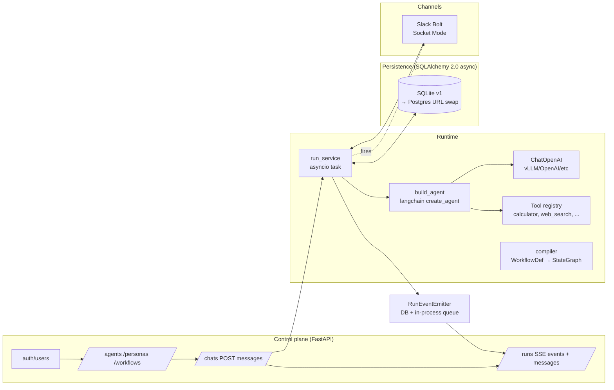

# AI Agent Orchestration Platform

Users sign up, create agents (system prompt + model + tools), open chats, and
talk to them either via HTTP or via a Slack DM. Conversations are persisted, runs
are observable via Server-Sent Events, and 2 visual workflow templates ship
pre-seeded.

---

## Architecture



Three boundaries:

- **Control plane (`app/api/`)** — thin routers, body validation, owner checks.
- **Runtime (`app/runtime/`, `app/services/`)** — agent compilation, run scheduling, memory.
- **Persistence (`app/db/`)** — one ORM file, repo helpers, idempotent schema bootstrap + template seed.

---

## Runtime choice — LangGraph + `langchain.agents.create_agent`

- **LangGraph** for graph compilation (workflow nodes, conditional edges, recursion limits for feedback loops). Battle-tested checkpointer/interrupt seam for future HITL.
- **`langchain.agents.create_agent`** (the non-deprecated ReAct loop) instead of a hand-rolled agent_node — fewer LOC, correct tool-call routing, OpenAI-compatible model swap by changing `base_url`.
- Tools are LangChain `BaseTool` (built-ins + `@tool`-decorated): one flat `dict[str, BaseTool]` registry. Adding MCP tools later = adapter wrapper, no other change.

Multi-agent runtime is OUT of v1; the seam is the registry — `agent_as_tool(agent_id)` is a one-screen factory when the second-agent loop ships.

---

## What's covered (TASK.md mapping)

| Requirement | Status | Where |
|---|---|---|
| Agent CRUD (name, role, system_prompt, model, tools, channels) | ✅ | `app/api/agents.py`, `domain.AgentConfig` |
| Agent config: memory + limits + guardrails + skills + schedules | ✅ schema, ✅ memory enforced | `domain.MemoryConfig`, `services/run_service.py::_resolve_context` |
| Visual workflow builder (conditions + feedback loops) | ✅ backend | `app/runtime/compiler.py` (AST-whitelist condition eval) |
| ≥ 2 pre-built workflow templates | ✅ | `app/db/seeds.py` (`research-and-write`, `supervised-loop`) |
| External channel — Slack | ✅ | `app/integrations/channels/slack_adapter.py` |
| Live monitoring (logs + inter-agent msgs + token/cost) | ✅ | SSE `GET /runs/{id}/events`, `run.finished` event carries `usage` |
| Message history persisted | ✅ | `MessageDB` + `GET /chats/{id}/messages` |
| 2+ agents executing real task | ✅ (live LLM e2e test) | `tests/integration/test_run_live.py`, supervised-loop template |
| Clear UI/runtime/persistence separation | ✅ | three top-level packages, no cross-leakage |
| Tests for critical paths | ✅ 75 tests passing | `tests/integration/` (auth, CRUD, isolation, live LLM, SSE, Slack) |
| README + setup + runtime justification | ✅ | this file |
| Async communication | ✅ | FastAPI + asyncio + `AsyncOpenAI` |

Deferred (documented in `memory/project-deferred-features.md`): Langfuse,
guardrails enforcement at node level, HITL, schedules executor, per-user Slack
BYOK, Postgres-by-default, multi-agent runtime, streaming, FastMCP.

---

## Memory — rolling summary

`MemoryConfig` (per-agent): `{type: "summary"|"buffer"|"none", window: N, summary_threshold: M}`.

Default `type="summary"` with `N=10`, `M=20`. Reason: **N < M**. Per-turn context = `summary_tokens + N * avg_msg_tokens`; verbatim is the expensive part, so keep N small. M (batch size before fold) is larger so each summarisation LLM call processes a worthwhile chunk — fewer round-trips, lower cost.

Trigger: once unsummarised history > N + M, the oldest M turns are folded into the rolling `summary` (stored on `ChatDB.summary`, count tracked in `summary_count`). Old `MessageDB` rows are **never deleted** — they stay for audit; they just stop being fed to the agent.

---

## Setup

### One-command local (SQLite + no Slack)

```bash
cd backend
cp .env.example .env   # set VLLM_BASE_URL / VLLM_API_KEY / VLLM_DEFAULT_MODEL
make demo              # uv sync + uvicorn :8000
```

`make demo` starts FastAPI, runs `create_all`, seeds the 2 workflow templates.
Open `http://localhost:8000/docs` for OpenAPI.

### With Slack (Socket Mode)

Add to `backend/.env`:

```
SLACK_BOT_TOKEN=xoxb-...
SLACK_APP_TOKEN=xapp-...    # Socket Mode
```

Restart — the adapter auto-starts on lifespan. DM the bot; reply lands on the same thread.

To attach yourself: register via web (`POST /auth/register`), then `PATCH /users/me {"slack_user_id":"U..."}`. No auto-provision in v1 (one auth path, deliberately).

### Full stack (Postgres + Redis via Docker)

```bash
docker compose up -d   # redis + backend (Postgres = URL-swap)
```

For Postgres prod: set `DATABASE_URL=postgresql+asyncpg://...` and add Alembic migrations (v1 ships `create_all` only — see "SQLite → Postgres" below).

---

## Tests

```bash
cd backend
make test    # 75 integration tests
```

Live-LLM and live-Tavily tests auto-skip when their env vars are unset, so the
suite passes offline.

---

## SQLite → Postgres swap

Set `DATABASE_URL=postgresql+asyncpg://user:pw@host/db`. SQLAlchemy code path is identical (async engine). For prod, add Alembic and remove `create_all` from `app/main.py::lifespan`. The two new columns on `ChatDB` (`summary`, `summary_count`) and the `RunEventDB` composite PK are vanilla SQL — both portable.

---

## Add a workflow template

Edit `app/db/seeds.py`: define a `WorkflowDef`, append to `_TEMPLATES`. Lifespan seeds it idempotently on next boot (keyed by name).

A template uses `agent` node `ref` strings as ROLE names (`researcher`, `worker`); the run-time binds them to the caller's agents (Step B today wires single-agent chats; the workflow runner extension is a small add on top of the compiler).

---

## Add a messaging channel

Mirror `app/integrations/channels/slack_adapter.py`:

1. Take credentials from `Settings` (add fields to `app/config.py`).
2. Wire a class with `start()` / `stop()` started in `main.py::lifespan` behind a creds-guard.
3. Implement an inbound handler: lookup user, find/create chat keyed by an external-thread identifier, call `start_run(session, chat_id=..., user_text=...)`, await reply via `wait_for_reply(run_id)`, post back to the channel.

`handle_slack_message` is a pure function on the dispatch side — no Bolt-isms in the business logic.

---

## Notable design decisions

- **No checkpointer for chat memory.** Chat history is rebuilt from `MessageDB` each turn (with rolling summary above). The Redis checkpointer seam is kept in `build_agent` for future HITL/interrupt work; lifespan tolerates Redis being down.
- **DB polling, not emitter queue, in the Slack reply path.** `start_run` returns before the background task starts; the emitter for that run isn't guaranteed to be in `EMITTERS` yet. Polling `RunDB.status` is robust, race-free, and fine at human-DM cadence (~250ms).
- **No `ChannelGateway` Protocol.** YAGNI — one channel today; the next channel can be a 50-LOC file mirroring `slack_adapter.py`. No interface ceremony until there's a second implementation.
- **No clone-on-register.** New users see the 2 templates as read-only (`user_id IS NULL`). To fork: `GET /workflows/{tmpl}` → `POST /workflows` with the same definition. Lazy fork beats eager copy of work most users won't touch.
- **404, not 403, on cross-user reads.** We don't leak resource existence.
- **AST-whitelist condition eval, not `eval()`.** `app/runtime/compiler.py::_ALLOWED` rejects calls, lambdas, comprehensions, attribute imports. Tested.

---

## Demo video

_TBD — record after frontend integration._
