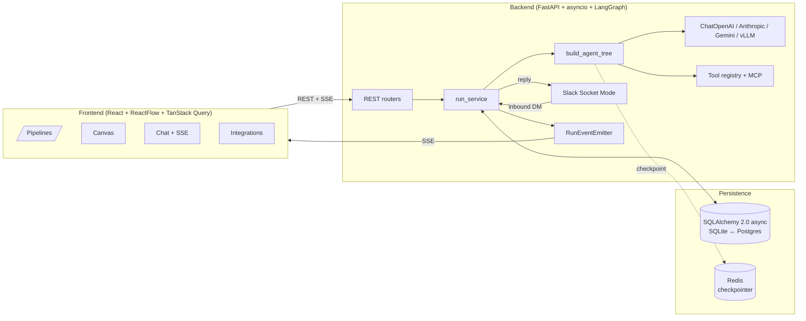

# Open Agent Orchestrator

Visual multi-agent pipelines. Build a supervisor with sub-agents, tools, and MCP servers on a canvas. Talk to it from the web or Slack. Works with any OpenAI-compatible LLM, Anthropic, or Gemini.

```bash
cp .env.example .env && docker compose up
```

→ `http://localhost` (UI) · `http://localhost:8000/docs` (API)

---

## Features

Ordered by impact — most useful first.

1. **Visual canvas for multi-agent pipelines.** React Flow + dagre. Drag a supervisor, attach sub-agents (recursive ReAct loops, depth-4 cap, cycles rejected at save), wire in built-in tools and MCP servers. Double-click to edit, hover to attach, color-coded by node type (supervisor > sub-agent > tool/MCP).
2. **Multi-channel out of the box.** Web chat with file attachments (PDFs + images) AND Slack via Socket Mode (no public URL — Bolt + xapp-/xoxb- tokens). One pipeline can be Slack-active at a time; switch live without restart.
3. **Bring-your-own LLM, any provider.** OpenAI, Anthropic, Google Gemini, vLLM, or anything OpenAI-compatible. Provider list is backend-driven (`GET /providers`) — add one with a one-line edit to `app/llm.py`. User-entered keys live in their browser localStorage (no server-side BYOK storage).
4. **MCP integration.** Register external MCP servers, auto-discover their tools at attach time, bind them to any sub-agent. A sample MCP server is included for testing.
5. **Reusable everything.** Sub-agents, tools, personas (named system prompts), skills (reusable knowledge docs), and tool credentials are all account-scoped and reusable across pipelines. Symmetric Attach / Detach / Delete UI on every reusable.
6. **Live run monitoring.** SSE event stream per run: `run.started`, `tool.start`/`end`, `agent.message`, `usage`, `run.finished`. Backlog replay + live feed. Token accounting aggregates across sub-agent calls (contextvar propagation).
7. **Draft → Deployed gating.** Pipelines start as Draft. They can't be used in chat or Slack until you explicitly click Deploy (which validates `llm.model`, `system_prompt`, sub-agent tree). Edits after deploy stay Deployed — no surprise re-validation.
8. **Per-user tool credentials with pre-save validation.** `POST /tool-configs/{tool}/validate` pings the upstream (e.g. Tavily one-result search) before storing the key. Errors are scrubbed — submitted keys never bounce back to the client.
9. **Rolling-summary memory.** N=10 verbatim tail, fold the oldest M=20 into `ChatDB.summary` once they exceed the threshold. `MessageDB` rows are never deleted (full audit trail).
10. **Graceful recursion-limit fallback.** When LangGraph hits `max_steps`, the run finishes with a clean apology message instead of a half-baked tool-result tail.
11. **Multi-user with JWT.** `fastapi-users` auth, per-user ownership on every row, `404 not 403` on cross-user reads (no existence leak).
12. **SQLite by default, Postgres by URL swap.** Idempotent migrations via SQLAlchemy `inspect()` — no Alembic in v1, no startup error logs from "column already exists".
13. **Docker Compose dev loop.** Full bind mount + anonymous volumes for `node_modules` / `.venv` → `docker compose down && up` = truly fresh install; restarts in between are instant. Vite polling enabled so macOS Docker bind mounts hot-reload reliably.

---

## What's in the box

```
backend/                          FastAPI + LangGraph
  app/
    api/                          REST routers (one file per resource)
      agents.py                   AgentConfig CRUD + sub-agent tree validation + POST /deploy
      chats.py                    Chat CRUD + reassign + message send (Draft pipelines rejected)
      runs.py                     Run status + SSE event stream
      providers.py                LLM provider catalogue (id + label)
      mcp_servers.py              MCP CRUD + live tool discovery
      personas.py / skills.py     Reusable system-prompt fragments / knowledge docs
      tool_configs.py             Per-user tool credentials (validate before save)
      slack.py                    Connect / disconnect / set-active (per-user)
      health.py
    runtime/
      agent.py                    build_agent_tree() — recursive ReAct, contextvar token aggregation
      tools.py                    Built-in tool registry (calculator, web_search, html_to_md, pdf_to_text, python_sandbox)
      checkpointer.py             Redis checkpointer (within-run state)
    services/run_service.py       Schedule + execute + persist + emit
    integrations/
      channels/slack_adapter.py   Bolt Socket Mode adapter
      sample_mcp_server.py        Demo MCP server (timestamp + word_count tools)
    db/
      models.py                   SQLAlchemy 2.0 async ORM
      repos.py                    Plain async helpers (caller owns the session)
      seeds/personas.yaml         Default personas, loaded on startup
    llm.py                        build_chat_model() — provider dispatch (openai/anthropic/google/vllm)
    domain.py                     Pydantic schemas (AgentConfig, LLMConfig, MemoryConfig, RunEvent)
    main.py                       FastAPI app + lifespan (Slack autostart, Redis checkpointer)

frontend/                         React + Vite + ReactFlow + TanStack Query + shadcn/Tailwind
  src/
    pages/
      Agents.tsx                  /pipelines list (Draft pill + Deploy button + hover Slack-active swap)
      Canvas.tsx                  /pipelines/:id/canvas (header: Draft pill, Save/Deploy button)
      Chat.tsx                    /chats (sidebar grouped by pipeline, message bubbles, SSE ticker)
      Integrations.tsx            /integrations (Slack card: per-user connect/edit/disconnect)
      Personas.tsx                /personas (CRUD + copy-default-as-mine)
      Skills.tsx                  /skills (CRUD)
      Login.tsx
    components/
      AgentCanvas.tsx             ReactFlow scene + left "Add Connection" panel (Sub-Agents / Tools / MCP)
      AgentForm.tsx               Full edit form (provider dropdown driven by /providers)
      PersonaPopup.tsx            Shared big-textarea dialog: New / Edit / Copy-from-default
      Layout.tsx, RunEventsPanel.tsx, ui/* (shadcn)
    api/                          One client per resource, all hit /api (Vite proxy → backend)
    hooks/                        useAuth, useSSE
    lib/                          llm-defaults (localStorage BYOK), utils, isPipelineRoot

docker-compose.yml                postgres + redis + backend + frontend + mcp-sample
```

---

## Architecture



Three boundaries, kept thin:
- **Control plane** (`api/`) — body validation, owner checks, call repos/services.
- **Runtime** (`runtime/`, `services/`) — agent-tree compilation, run scheduling, memory, retries.
- **Persistence** (`db/`) — one ORM file, repo helpers, idempotent bootstrap.

**No DB session held during the LLM call.** `_execute` splits a turn into pre-LLM (load + insert user message), LLM (build tree + invoke — `build_agent_tree` takes a `session_factory`, not a session), post-LLM (insert agent reply + finalize). Keeps the pool free under concurrent load.

---

## Setup

### Full stack (Docker — recommended)

```bash
cp .env.example .env   # set LLM creds (any OpenAI-compatible provider), optional Slack tokens
docker compose up
```

Services: `ca-postgres`, `ca-redis`, `ca-backend`, `ca-frontend`, `ca-mcp-sample`.

- Backend: `http://localhost:8000` (OpenAPI at `/docs`)
- Frontend: `http://localhost`
- Truly-fresh `down && up` reinstalls deps; quick `up` reuses cached volumes.

### Backend only

```bash
cd backend
cp .env.example .env
make demo    # uv sync + uvicorn :8000 (SQLite)
make test    # 66 tests
```

Postgres without Docker: set `DATABASE_URL=postgresql+asyncpg://…` in `.env`.

### Slack

Either set `SLACK_BOT_TOKEN` + `SLACK_APP_TOKEN` in `.env` (auto-starts in lifespan), or paste them in the UI at `/integrations`. The first user to connect owns the platform bot; subsequent connects atomically clear the previous owner's tokens.

To link your Slack identity: `PATCH /users/me {"slack_user_id":"U..."}`.

---

## API

| Method | Path | Auth | Notes |
|---|---|---|---|
| POST | /auth/register | — | Create user |
| POST | /auth/jwt/login | — | Returns JWT |
| GET/PATCH | /users/me | JWT | Profile + `slack_user_id` |
| GET/POST/PUT/DELETE | /agents | JWT | Full `AgentConfig` CRUD; POST/PUT validate sub-agent tree |
| POST | /agents/{id}/deploy | JWT | Validate config + mark Deployed |
| GET | /providers | JWT | LLM provider catalogue (id + label) |
| GET/POST/PUT/DELETE | /personas, /skills | JWT | Owned + read-only globals |
| GET/POST/DELETE | /mcp-servers | JWT | + `GET /mcp-servers/{id}/tools` for live discovery |
| GET/PUT/DELETE | /tool-configs | JWT | + `POST /tool-configs/{tool}/validate` |
| GET | /tools | — | Built-in tool catalogue |
| GET/POST/PATCH/DELETE | /chats | JWT | PATCH reassigns to a Deployed pipeline only |
| POST | /chats/{id}/messages | JWT | Schedule a run; accepts file attachments |
| GET | /chats/{id}/messages | JWT | History |
| GET | /runs/{id} | JWT | Status + tokens + cost |
| GET | /runs/{id}/events | JWT or `?token=` | SSE (backlog + live) |
| GET | /slack/status | JWT | Per-user `{connected, active_agent_id}` |
| POST | /slack/connect, /slack/active, /slack/disconnect | JWT | Single-owner platform bot |
| GET | /health | — | `{"status": "ok"}` |

---

## Notable design decisions

- **Pipeline = root agent.** Computed (`pipeline = agent NOT referenced as subagent`), no `is_pipeline` flag. Stable under in-place edits.
- **Supervisor tree, not DAG.** The agent IS the workflow. Sub-agents are LangChain tools, depth-4 capped, cycles rejected at save.
- **Multi-provider, one config.** `LLMConfig.provider` → dispatch in `build_chat_model`. UI shows uniform base-url / api-key / model fields; provider quirks handled in backend.
- **No chat memory in the checkpointer.** History rebuilt from `MessageDB` each turn (+ rolling summary on `ChatDB`). Redis is reserved for within-run state.
- **No Alembic in v1.** `create_all()` + Inspector-driven additive migrations (no startup ERROR logs).
- **Draft → Deployed is explicit.** No auto re-Draft on edit; deploy validates and sets `deployed_at` once.
- **Single-owner platform Slack bot.** `POST /slack/connect` clears any prior user's tokens before saving yours. Per-user `/slack/status` so new users see "Connect", not "Connected".
- **404 not 403 on cross-user reads.** No existence leak.
- **SSE dual auth.** EventSource can't send headers → `?token=` accepted alongside `Authorization: Bearer`.
- **Tool credentials never echo back.** `validate` returns generic errors, logs only exception class.
- **Reusable everything has symmetric UI.** Sub-agents and MCP servers both expose `Attach` / `Detach` / `× Delete` with consistent colors (emerald / amber-blue / red).

---

## Roadmap

Ordered by likely sequence.

- [ ] **Subscription tier with server-side LLM defaults.** Free = BYOK (current). Paid = backend-managed key pool, no user setup. The free/paid flag already exists on `UserDB.plan`.
- [ ] **Swarm-style collaboration.** Peer-to-peer agent handoff (not just supervisor → sub). Complements the current hierarchy.
- [ ] **Scheduled runs.** Cron-style triggers — fire a pipeline on a schedule, post output to Slack / web / webhook.
- [ ] **WhatsApp integration.** Second messaging channel alongside Slack (Twilio or Meta Cloud API).
- [ ] **Open-source pipeline catalogue.** Browse + import community pipelines (similar to GPT Store / Replit templates, but pipelines and skills).
- [ ] **Planner-decider node.** A router in front of the supervisor that classifies queries before dispatching.
- [ ] **Streaming tokens.** SSE already streams events; pipe per-token deltas to the UI for faster perceived latency.
- [ ] **Langfuse tracing.** Drop-in callback handler — already designed (see notes below).
- [ ] **Human-in-the-loop.** LangGraph interrupt → DB-backed approval queue → resume.
- [ ] **Per-user Slack BYOK.** Drop the single-owner platform bot model; each user gets their own Socket Mode connection.

---

## Tests

```bash
cd backend && make test   # 66 tests
```

Unit + integration: auth, agent CRUD with sub-agent tree validation (cycle / depth / cross-user / tool-name collision), Draft-rejection gating, persona/skill globals + ownership, tool-config validation flow, MCP discovery, chat + run lifecycle, Slack inbound dispatch, memory rolling summary, multimodal file handling, sub-agent recursive build, **live LLM end-to-end** (skipped without creds).

Frontend: `npx tsc --noEmit` clean. Backend: `ruff check` clean.

---

## Langfuse (optional)

```bash
pip install langfuse
export LANGFUSE_PUBLIC_KEY=pk-...
export LANGFUSE_SECRET_KEY=sk-...
```

```python
# run_service._execute → invoke config:
from langfuse.langchain import CallbackHandler
config={"callbacks": [CallbackHandler()], "recursion_limit": ...}
```
