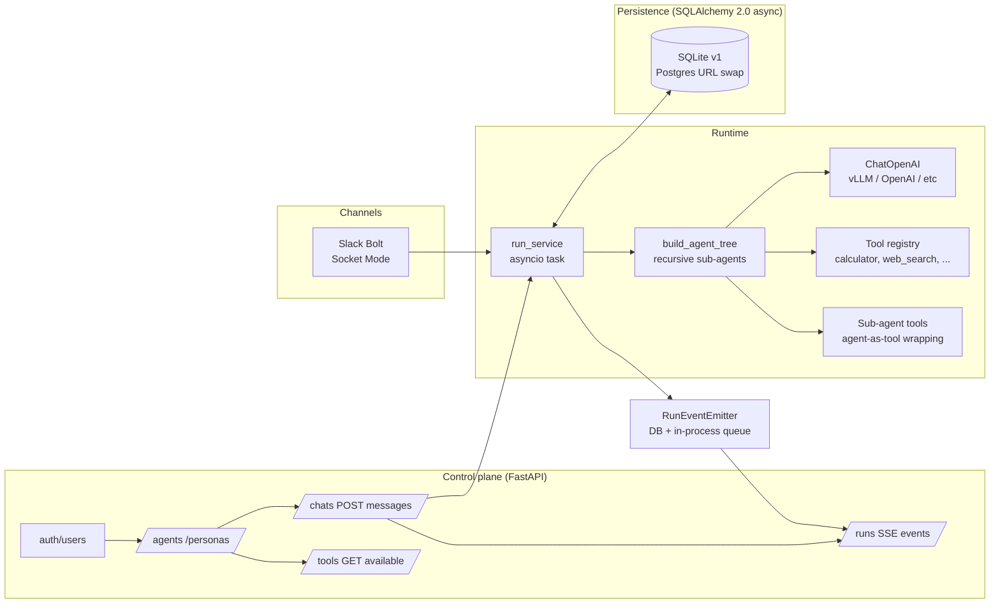

# AI Agent Orchestration Platform

Create AI agents with configurable personality, tools, and memory. Connect them
into supervisor trees where agents delegate to sub-agents autonomously. Talk to
them via the web UI or Slack DM. Observe runs in real-time via SSE.

---

## Architecture



Three boundaries:

- **Control plane (`app/api/`)** — thin routers, body validation, owner checks.
- **Runtime (`app/runtime/`, `app/services/`)** — agent tree compilation, run scheduling, memory.
- **Persistence (`app/db/`)** — one ORM file, repo helpers, idempotent schema bootstrap.

---

## Runtime choice — LangGraph + `langchain.agents.create_agent`

- **LangGraph** for agent compilation (ReAct tool-call loop, recursion limits). Checkpointer seam for future HITL.
- **`langchain.agents.create_agent`** (non-deprecated ReAct loop) — fewer LOC, correct tool-call routing, model swap by changing `base_url`.
- Tools are LangChain `BaseTool` (`@tool`-decorated): flat `dict[str, BaseTool]` registry.
- **Multi-agent = supervisor tree.** Sub-agents are wrapped as LangChain tools via `build_agent_tree`. The parent LLM tool-calls a sub-agent by name with a `task` string; the sub-agent runs its own ReAct loop and returns. Nesting capped at depth 4. Cycles rejected at config-save time via DFS.

---

## What's covered (TASK.md mapping)

| Requirement | Status | Where |
|---|---|---|
| Agent CRUD (name, role, system_prompt, model, tools, channels) | Done | `app/api/agents.py`, `domain.AgentConfig` |
| Agent config: memory + limits + guardrails + skills + schedules | Schema + memory enforced | `domain.MemoryConfig`, `run_service::_resolve_context` |
| Multi-agent (supervisor tree, arbitrary nesting) | Done | `app/runtime/agent.py::build_agent_tree` (recursive), depth cap 4, cycle detection at save |
| External channel — Slack | Done | `app/integrations/channels/slack_adapter.py` (Bolt Socket Mode) |
| Live monitoring (logs + inter-agent msgs + token/cost) | Done | SSE `GET /runs/{id}/events`, `run.finished` carries `usage` |
| Message history persisted | Done | `MessageDB` + `GET /chats/{id}/messages` |
| 2+ agents executing real task | Done | Live e2e test: Boss delegates to Researcher (web_search) |
| Clear UI/runtime/persistence separation | Done | Three top-level packages |
| Tests for critical paths | 67 tests | Auth, CRUD, sub-agent tree validation, live LLM delegation, Slack dispatch |
| Async communication | Done | FastAPI + asyncio + AsyncOpenAI |
| Dynamic tool discovery | Done | `GET /tools` returns REGISTRY keys + descriptions |
| Chat agent reassignment | Done | `PATCH /chats/{id}` with new `agent_id` |

---

## Memory — rolling summary

`MemoryConfig` (per-agent): `{type: "summary"|"buffer"|"none", window: N, summary_threshold: M}`.

Default `N=10`, `M=20` (`N < M`). Verbatim context = last N messages. Once unsummarised history exceeds N+M, the oldest M turns fold into a rolling summary (stored on `ChatDB.summary`). Old `MessageDB` rows are never deleted — they stay for audit.

---

## Setup

### One-command local (SQLite, no Slack)

```bash
cd backend
cp .env.example .env   # set VLLM_BASE_URL / VLLM_API_KEY / VLLM_DEFAULT_MODEL
make demo              # uv sync + uvicorn :8000
```

Open `http://localhost:8000/docs` for OpenAPI. Frontend runs separately (`cd frontend && npm run dev`).

### With Slack (Socket Mode)

Add to `backend/.env`:

```
SLACK_BOT_TOKEN=xoxb-...
SLACK_APP_TOKEN=xapp-...
```

Restart — adapter auto-starts. DM the bot; reply lands on the same thread.

To link your Slack user: `POST /auth/register`, then `PATCH /users/me {"slack_user_id":"U..."}`.

### Full stack (Redis via Docker)

```bash
docker compose up -d   # redis + backend
```

For Postgres: set `DATABASE_URL=postgresql+asyncpg://...` and add Alembic migrations.

---

## Tests

```bash
cd backend
make test    # 67 tests
```

Live-LLM and live-Tavily tests auto-skip when env vars are unset.

---

## API endpoints

| Method | Path | Auth | Notes |
|---|---|---|---|
| POST | /auth/register | No | Create user |
| POST | /auth/jwt/login | No | Returns JWT |
| GET/PATCH | /users/me | JWT | Profile + slack_user_id |
| GET/POST/PUT/DELETE | /agents | JWT | Full AgentConfig CRUD. POST/PUT validate sub-agent tree |
| GET/POST/PUT/DELETE | /personas | JWT | Named system_prompt library |
| GET/POST/PATCH/DELETE | /chats | JWT | PATCH reassigns agent_id / persona_id |
| POST | /chats/{id}/messages | JWT | Schedule run, returns run_id |
| GET | /chats/{id}/messages | JWT | Message history |
| GET | /runs/{id} | JWT | Run status + tokens + cost |
| GET | /runs/{id}/events | JWT or ?token= | SSE stream (backlog + live) |
| GET | /tools | No | Available tool names + descriptions |
| GET | /health | No | `{"status": "ok"}` |

---

## Add a messaging channel

Mirror `app/integrations/channels/slack_adapter.py`:

1. Add credentials to `app/config.py::Settings`.
2. Wire a class with `start()` / `stop()` in `main.py::lifespan` behind a creds-guard.
3. Inbound handler: lookup user, find/create chat, call `start_run`, await `wait_for_reply`, post back.

---

## Langfuse (optional tracing)

```bash
pip install langfuse
export LANGFUSE_PUBLIC_KEY=pk-...
export LANGFUSE_SECRET_KEY=sk-...
export LANGFUSE_HOST=https://cloud.langfuse.com
```

Wire into `run_service._execute`:

```python
from langfuse.langchain import CallbackHandler
result = await agent.ainvoke(
    {"messages": lc_messages},
    config={"callbacks": [CallbackHandler()], "recursion_limit": ...},
)
```

---

## Notable design decisions

- **Supervisor tree, not DAG.** Agent IS the workflow. Sub-agents are tools. No separate workflow primitive, no compiler, no condition DSL. The LLM decides routing.
- **No checkpointer for chat memory.** History rebuilt from `MessageDB` each turn (with rolling summary). Redis seam kept for future HITL.
- **DB polling in Slack reply path.** `start_run` returns before the bg task starts; polling `RunDB.status` is race-free.
- **SSE dual auth.** `GET /runs/{id}/events` accepts both `Authorization: Bearer` header and `?token=` query param (EventSource can't send headers).
- **Hard-delete agents, nullable chat FK.** Deleting an agent sets `ChatDB.agent_id = NULL`. User reassigns via `PATCH /chats/{id}`.
- **404, not 403, on cross-user reads.** No existence leak.
- **MAX_AGENT_DEPTH = 4.** Enforced at config save (DFS cycle + depth check) AND at runtime (defence in depth).

---

## Demo video

_TBD — record after frontend integration._
