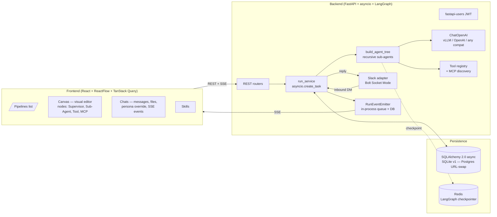

# AI Agent Orchestration Platform

Build **agentic pipelines** — an LLM supervisor plus the sub-agents, tools, skills, and external integrations it needs — visually on a canvas, or via REST. Talk to a pipeline from the web UI or Slack DM. Watch every run live over SSE.

A "pipeline" is the unit a user publishes: a root agent + its sub-agent tree + bound tools + MCP servers + channel bindings, identified by the root's config id. Chats and Slack threads always attach to **pipelines**, never to a bare sub-agent.

---

## Architecture



Three boundaries — kept thin:

- **Control plane** (`backend/app/api/`) — routers do body validation, owner checks, and call repos/services.
- **Runtime** (`backend/app/runtime/`, `backend/app/services/`) — agent-tree compilation, run scheduling, memory, retries.
- **Persistence** (`backend/app/db/`) — one ORM file, repo helpers, idempotent schema bootstrap (`create_all` + `seed_defaults`).

---

## What a pipeline is made of

Every field is on the `AgentConfig` Pydantic model (`backend/app/domain.py`) and round-trips through `GET/PUT /agents`.

| Component | Field | Purpose |
|---|---|---|
| Identity | `name`, `role`, `description`, `system_prompt` | Defaults exist; only `system_prompt` is enforced. Use a persona to override at chat-time. |
| LLM | `llm: LLMConfig` | `base_url`, `api_key`, `model`, `temperature`, `max_tokens`, `timeout_s` — OpenAI-compatible (vLLM, OpenAI, LiteLLM, Anthropic-via-proxy). Frontend persists last-used in `localStorage` so new pipelines pre-fill. |
| Memory | `memory: MemoryConfig` | Rolling summary (`type: "summary"`, default `N=10` verbatim tail, `M=20` summary batch). Also `"buffer"` and `"none"`. |
| Limits | `limits.max_steps` | Hard cap on ReAct iterations per turn (`recursion_limit` passed to LangGraph). |
| Tools | `tools: list[str]` | Names from the platform `REGISTRY` — `calculator`, `web_search`, `html_to_markdown`, `pdf_to_text`, `python_sandbox`. `GET /tools` returns `{name, display_name, description}` for each. |
| Sub-agents | `subagents: list[UUID]` | Each is wrapped as a LangChain tool — the parent LLM calls it by name with a `task` string; the sub-agent runs its own ReAct loop. **Recursive, capped at depth 4.** Cycles rejected at `POST/PUT /agents` time via DFS. |
| Skills | `skills: list[UUID]` | Persistent knowledge/instruction snippets (e.g. coding conventions, rubrics). Appended to `system_prompt` at run-time. |
| MCP servers | `mcp_servers: list[UUID]` | External tool servers; tools discovered at every build via `langchain-mcp-adapters` then bound alongside built-ins. |
| Channels | `channels: list[ChannelBinding]` | `{channel: "slack" | "web", external_id?}`. The slack binding is what routes Slack DMs to this pipeline. |

---

## Per-chat overrides — personas

Personas (`PersonaDB`) are named `system_prompt`s that override the pipeline's stored prompt for a specific chat. A persona belongs to one user, except for global personas (`user_id IS NULL`) which everyone sees read-only.

- **Default Supervisor** is seeded on every app startup (`db/__init__.seed_defaults`) as a global — guarantees the persona dropdown is never empty.
- Users can create their own personas inline in any "create chat" or "create sub-agent" form.
- Globals cannot be edited or deleted (`update_persona`/`delete_persona` return None when the row's `user_id IS NULL`).

The chat dialogs and the canvas inline "Create sub-agent" form share one UX pattern: a dropdown of available personas + a `+ Create persona` inline form. No `__none__` sentinel; no awkward dual-mode toggle.

---

## Per-user tool credentials

Some tools need user-provided keys (e.g. Tavily for `web_search`). These live in `UserToolConfigDB` keyed on `(user_id, tool_name)`:

- `POST /tool-configs/{tool_name}/validate` — pings the upstream service (e.g. one-result Tavily search) before saving. Errors are scrubbed and logged with `type(exc).__name__` rather than raw exception text — submitted keys never bounce back to the client.
- `PUT /tool-configs/{tool_name}` — persists the credential.
- At run-time, `build_registry(tool_configs=…)` produces a per-user tool registry: stateless tools always included; credentialed tools included only when their key is present.

---

## Multi-channel — web + Slack

The web UI hits `POST /chats/{id}/messages` and watches `GET /runs/{id}/events` (SSE: `run.started`, `agent.message`, `usage`, `run.finished`).

**Slack** runs as a single platform bot via Bolt Socket Mode (no public URL needed):

- **BYO tokens via UI.** `POST /slack/connect {bot_token, app_token, agent_id?}` saves tokens to `UserDB`, atomically swaps the `slack` channel binding to the chosen pipeline (clears it from every other agent), and (re)starts the adapter live — no container restart needed.
- **Single Slack-active pipeline.** Only one of your pipelines can hold the slack binding at a time. Connecting on pipeline B automatically clears it from pipeline A. The Pipelines page shows a green "Slack active" badge on whichever one is bound.
- **Conversation continuity.** A Slack chat is keyed by `(user_id, channel_id, thread_ts, agent_id)`. Same pipeline + same thread → continue. **Switching pipelines starts a new conversation** even mid-thread, by design: the new pipeline gets a fresh `ChatDB` row; the old one stays archived under the old `agent_id`.
- **Inbound flow** (`slack_adapter.handle_slack_message`): match `slack_user_id` → `UserDB`, pick the slack-bound pipeline (or fall back to most-recently-updated), find/create the chat, schedule a run, poll for completion, post the reply on the same thread.

---

## File attachments

The chat input accepts images + PDFs. `_process_files` (in `run_service`) routes them at run-time:

- **PDF** → `pypdf` text extraction, prepended to the user message as `[Attached PDF: name]\n<pages>`.
- **Image** → base64-encoded into a LangChain multimodal `image_url` content block, attached to the last `HumanMessage`. Works with any vision-capable model behind your OpenAI-compatible endpoint.

---

## Memory — rolling summary

Per-pipeline `MemoryConfig` keeps cross-turn memory in the DB, not in a graph checkpoint:

- `type: "summary"` (default): verbatim tail of `N` messages; when unsummarised history exceeds `N+M`, the oldest `M` turns are folded into `ChatDB.summary` via one summarisation call. `MessageDB` rows are never deleted (audit trail).
- `type: "buffer"`: last-N only.
- `type: "none"`: pass everything.

The summary is woven into the effective system prompt as a single "Earlier conversation summary" block; some providers (vLLM/Qwen) reject mid-conversation `SystemMessage`, so we never prepend one mid-thread.

LangGraph's Redis checkpointer is still wired for **within-run** state (HITL interrupts, multi-step ReAct replay) — `thread_id = run_id` so within-run state never collides with cross-turn DB memory.

---

## Live monitoring (SSE)

`GET /runs/{id}/events` streams `RunEvent` records (`run.started`, `node.started`, `tool.start`/`tool.end`, `agent.message`, `usage`, `run.finished`, `run.error`) over Server-Sent Events. Endpoint accepts both `Authorization: Bearer` and `?token=` query param — EventSource can't send custom headers.

Backlog rows from `RunEventDB` are flushed first (so a late subscriber doesn't miss anything), then live events from an in-process `EMITTERS` registry keyed by `run_id`.

---

## DB session discipline

The runtime takes care to **never pin a DB connection during an LLM call**. `_execute` splits a turn into three phases:

1. **Pre-LLM**: load chat + agent config, insert the user message, resolve memory, fetch per-user tool configs — all in one short-lived session, then close.
2. **LLM**: build LangChain messages + the agent tree + invoke. `build_agent_tree` accepts a `session_factory`, not a `session`, so each build opens its own short-lived session for MCP/sub-agent lookups and closes it before any `get_tools()` network call. **No DB session is held during the LLM round-trip.**
3. **Post-LLM**: open a fresh session for the agent-message insert + `finalize_run`.

This keeps the connection pool free for concurrent requests under load — important when scaling to Postgres.

---

## Setup

### Full stack (Docker Compose — recommended)

```bash
cp .env.example .env   # set OpenAI-compatible LLM creds, optional Slack tokens
docker compose up
```

Brings up: `ca-postgres` (Postgres 16), `ca-redis` (Redis 7), `ca-backend` (FastAPI + uvicorn), `ca-frontend` (Vite + nginx), `ca-mcp-sample` (a sample MCP server for testing).

- Backend: `http://localhost:8000` (OpenAPI at `/docs`)
- Frontend: `http://localhost:80`

`create_all()` runs at startup; ADD COLUMN migrations are wrapped in SAVEPOINTs so a duplicate-column error on Postgres rolls back only the savepoint, not the whole transaction. `seed_defaults()` then inserts the global Default Supervisor persona idempotently.

### Backend only (SQLite, local Python)

```bash
cd backend
cp .env.example .env
make demo   # uv sync + uvicorn :8000
```

For Postgres without docker: set `DATABASE_URL=postgresql+asyncpg://…` in `.env`.

### Slack (Socket Mode)

Either set `SLACK_BOT_TOKEN` + `SLACK_APP_TOKEN` in `backend/.env` (adapter auto-starts in `lifespan`), or paste them in the UI: open a pipeline → Canvas → "Connect Slack" — backend saves tokens to your `UserDB` row and the adapter restarts immediately. To link your Slack identity: `PATCH /users/me {"slack_user_id":"U..."}`.

---

## Frontend (the Canvas)

- `/pipelines` — list of root pipelines (computed: any agent NOT referenced as a sub-agent by another agent). Sub-agents are not listed here — they're edited inside the canvas.
- `/pipelines/:id/canvas` — ReactFlow + dagre auto-layout, 4 node types (Supervisor violet, Sub Agent blue, Tool emerald, MCP amber). Hover any node → `+` button to attach. Double-click / right-click → properties sheet (full edit form). The left panel lets you attach existing sub-agents, create new ones inline with a persona, register new MCP servers, and toggle built-in tools (with API-key validation flow for credentialed tools).
- `/chats/:id` — message list, multimodal input (image + PDF), live SSE event ticker, persona selector with inline `+ Create persona`, pipeline reassign dialog. Chats are grouped by pipeline in the sidebar.
- `/skills` — skills CRUD.

The frontend persists last-used LLM credentials in `localStorage` (`llm-defaults.ts`) so a fresh pipeline pre-fills provider URL + model + key. Sub-agent inline create forms inherit the supervisor's LLM config.

---

## Tests

```bash
cd backend
make test    # 68 tests
```

Unit + integration coverage: auth, agent CRUD with sub-agent tree validation (cycle, depth, cross-user, name-collides-with-tool), persona/skill globals + ownership, tool-config validation flow, MCP discovery, chat + run lifecycle, Slack inbound dispatch (mocked + live), memory rolling summary, multimodal file handling, sub-agent recursive build, **live LLM end-to-end** (skipped without creds — vLLM/OpenAI/etc).

Frontend typechecks with `tsc --noEmit`. Backend lints clean with `ruff check`.

---

## API endpoints

| Method | Path | Auth | Notes |
|---|---|---|---|
| POST | /auth/register | No | Create user |
| POST | /auth/jwt/login | No | Returns JWT |
| GET/PATCH | /users/me | JWT | Profile + `slack_user_id` |
| GET/POST/PUT/DELETE | /agents | JWT | Full `AgentConfig` CRUD. POST/PUT validate the sub-agent tree (cycle, depth, name-collides-with-tool). |
| GET/POST/PUT/DELETE | /personas | JWT | Owned + read-only globals (`Default Supervisor` is seeded). |
| GET/POST/PUT/DELETE | /skills | JWT | Reusable system-prompt fragments. |
| GET/POST/PUT/DELETE | /mcp-servers | JWT | External MCP tool servers. `GET /mcp-servers/{id}/tools` triggers live discovery. |
| GET | /tool-configs | JWT | List per-user tool credentials. |
| POST | /tool-configs/{tool}/validate | JWT | Ping upstream with the submitted key — generic error message, structured log. |
| PUT/DELETE | /tool-configs/{tool} | JWT | Upsert / drop a credential. |
| GET | /tools | No | Available tool names + `display_name` + descriptions. |
| GET/POST/PATCH/DELETE | /chats | JWT | PATCH reassigns `agent_id` / `persona_id`. |
| POST | /chats/{id}/messages | JWT | Schedule a run, returns `run_id`. Accepts file attachments. |
| GET | /chats/{id}/messages | JWT | Message history. |
| GET | /runs/{id} | JWT | Run status + tokens + cost. |
| GET | /runs/{id}/events | JWT or `?token=` | SSE stream (backlog + live). |
| GET | /slack/status | JWT | `{connected, active_agent_id}`. |
| POST | /slack/connect | JWT | Save tokens + atomically swap the single Slack-active pipeline + (re)start adapter live. |
| POST | /slack/disconnect | JWT | Clear tokens + stop adapter. |
| GET | /health | No | `{"status": "ok"}` |

---

## Notable design decisions

- **Pipeline = published unit.** A root agent + its full sub-agent tree + tools + MCP. Computed as roots — no `is_pipeline` schema flag — `pipeline = agent NOT referenced as subagent by anyone`. Stable under in-place edits, zero migration cost.
- **Supervisor tree, not DAG.** The agent IS the workflow. Sub-agents are tools, depth-4 capped, cycles rejected at save. No separate workflow primitive, no compiler.
- **OpenAI-compatible only.** One `ChatOpenAI` model class for vLLM, OpenAI, LiteLLM, Anthropic-via-proxy, anything. Model swap is a base URL change.
- **No checkpointer for chat memory.** History rebuilt from `MessageDB` each turn (with rolling summary on `ChatDB.summary`). Redis seam reserved for within-run HITL.
- **No Alembic in v1.** `create_all()` + inline ALTER TABLEs (savepoint-wrapped for Postgres-correctness). v2 swaps `DATABASE_URL` to Postgres and bolts on Alembic.
- **MAX_AGENT_DEPTH = 4.** Enforced at config save (DFS cycle + depth check) AND at runtime (defence in depth).
- **404, not 403, on cross-user reads.** No existence leak.
- **SSE dual auth.** EventSource can't send headers, so `?token=` is accepted in addition to `Authorization: Bearer`.
- **Hard-delete agents, nullable chat FK.** Deleting an agent sets `ChatDB.agent_id = NULL`. User reassigns via `PATCH /chats/{id}` (UI only lists pipelines, not sub-agents).
- **Sub-agent name uniqueness vs tool registry.** A sub-agent's `name` becomes a LangChain tool name on its parent — colliding with a built-in tool would shadow it. Rejected at save.
- **Tool credentials never echo back.** `POST /tool-configs/{tool}/validate` returns a generic error to the client and logs only the exception class — guards against accidental key leak via reflected error text.

---

## Deferred (out of v1 scope, design-ready)

Per `project-deferred-features` memory: standalone workflows, streaming token output, planner-as-node, schedules (cron), Langfuse tracing, HITL pauses, guardrails enforcement, per-user Slack BYOK (currently last-write-wins single-platform-bot).

---

## Optional — Langfuse tracing

```bash
pip install langfuse
export LANGFUSE_PUBLIC_KEY=pk-...
export LANGFUSE_SECRET_KEY=sk-...
```

```python
# In run_service._execute, add to the invoke config:
from langfuse.langchain import CallbackHandler
config={"callbacks": [CallbackHandler()], "recursion_limit": ...},
```
